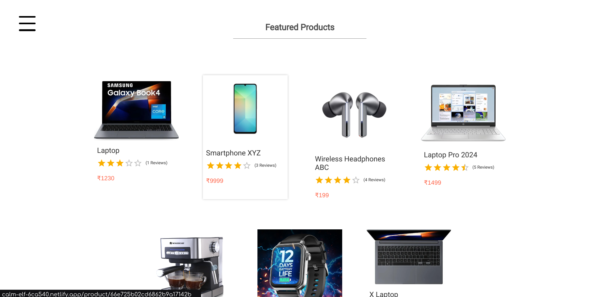
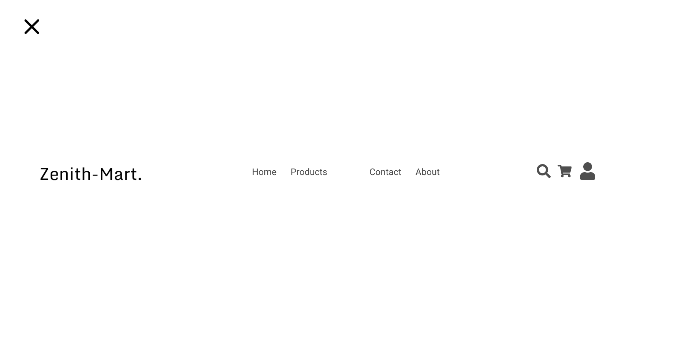
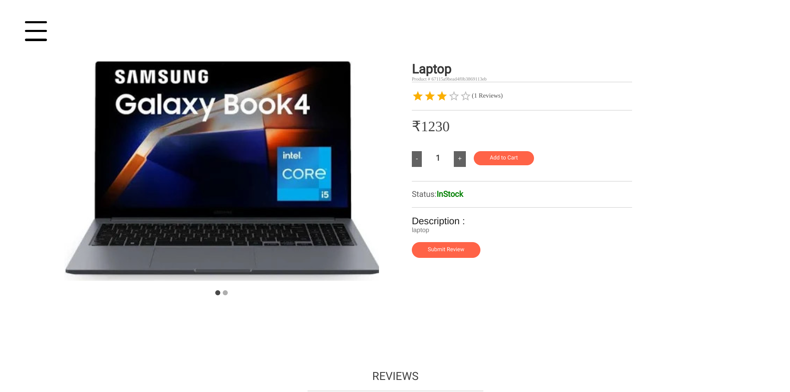
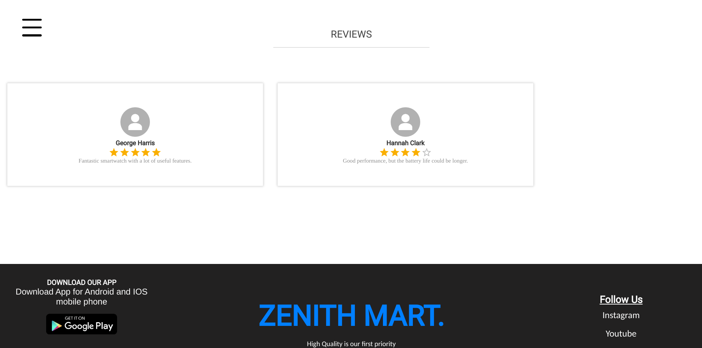

# ZenithMart 🛍️

ZenithMart is a modern e-commerce platform built to provide a seamless shopping experience. This full-stack application features a responsive frontend and a robust backend API.

## 🌐 Live Demo

- Frontend: [https://calm-elf-6ca540.netlify.app](https://calm-elf-6ca540.netlify.app)
- Backend API: [https://zenith-mart.onrender.com](https://zenith-mart.onrender.com)

## 🖼️ Screenshots

### Homepage




_Description of the homepage features_

### Product Catalog




## ✨ Features

- User authentication and authorization
- Product catalog with search and filtering
- Shopping cart functionality
- Secure payment processing
- Order tracking
- Responsive design for mobile and desktop
- Admin dashboard for inventory management

## 🛠️ Tech Stack

### Frontend

- React.js
- Redux for state management
- CSS for styling
- Axios for API calls

### Backend

- Node.js
- Express.js
- MongoDB
- JWT for authentication

## 🚀 Getting Started

### Prerequisites

- Node.js (v14 or higher)
- MongoDB
- npm or yarn

### Installation

1. Clone the repository

```bash
git clone https://github.com/gitxAnkit/E-commerce.git
```

2. Install frontend dependencies

```bash
cd frontend
npm install
```

3. Install backend dependencies

```bash
cd backend
npm install
```

4. Set up environment variables

```bash
# Backend .env
PORT=5000
DB_URI=your_mongodb_uri
JWT_SECRET=your_jwt_secret
JWT_EXPIRE=your_jwt_expire
COOKIE_EXPIRE=your_cookie_expire
```

5. Run the development servers

```bash
# Backend
npm run dev

# Frontend
npm run dev
```

---

⭐️ If you found this project helpful, please consider giving it a star!
